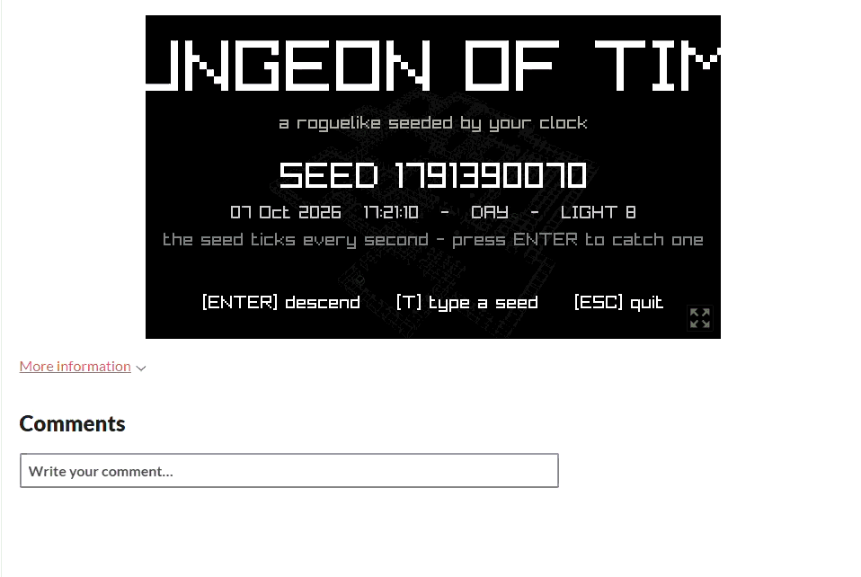

## How to play

Find the stairs on each floor and go down. Get past **floor 10** to escape.

| Key               | Action                                    |
|-------------------|-------------------------------------------|
| WASD / Arrow keys | Move. Walk into an enemy to attack it     |
| Space             | Wait one turn                             |
| R                 | Restart with the same seed                |
| N                 | New run with a fresh seed from the clock  |
| Esc               | Back to the title screen (quits from the title) |
| T *(title)*       | Type in a seed                            |
| C *(title)*       | Go back to the ticking clock seed         |

**What you'll see**

| Thing                | Looks like                          |
|----------------------|-------------------------------------|
| You                  | White sphere with a ring under it   |
| Crawler              | Small black cube that hops. Weak, moves every turn |
| Brute                | Tall black cube. Hits harder, moves every other turn |
| Potion               | Small floating white orb. Heals you |
| Stairs               | White square with a spinning arrow  |
| Places you've seen   | Faint wireframe                     |

**Rules**
- The game is turn-based: enemies only move when you move or wait.
- Enemies chase you when they're in your light. Otherwise they wander.
- Walking into a wall doesn't use up a turn.
- Each floor down gives +1 max HP and heals 2. Your attack goes up every 3 floors.
- Enemies get tougher and more common the deeper you go.

---

## Running it

### Notepad++ (raylib installer)

1. Open **Notepad++ for raylib** (the desktop shortcut from the raylib installer).
2. Open `main.c` from this folder.
3. Press **F6**, choose `raylib_compile_execute`, and click OK.

It builds `main.exe` and starts the game.

### build.bat

Double-click `build.bat`, or run it from a terminal:

```bat
build.bat run
```

This builds `game.exe` and starts it. If `gcc` isn't on your PATH, it uses the one in `C:\raylib\w64devkit\bin`.

### make

```sh
make run
```

### By hand

```sh
gcc main.c -o game.exe -std=c99 -Wall -Wextra -O2 -Iraylib/include -Lraylib/lib -lraylib -lopengl32 -lgdi32 -lwinmm
```

### In the browser (Emscripten)

The web build is already in `web/` (`index.html`, `index.js`, `index.wasm`). To rebuild it, run:

```bat
build_web.bat
```

That sets up emsdk from `C:\raylib\emsdk`, builds into `web/`, and makes `dungeon-of-time-web.zip` for itch.io. The `emcc` command it runs is:

```sh
emcc main.c -o web/index.html -std=gnu99 -Os -Wall -IC:/raylib/raylib/src C:/raylib/raylib/src/libraylib.web.a -DPLATFORM_WEB -sUSE_GLFW=3 -sASYNCIFY -sTOTAL_MEMORY=67108864 --shell-file C:/raylib/raylib/src/minshell.html
```

`-sASYNCIFY` lets the normal `while (!WindowShouldClose())` loop run in the browser without being rewritten.

Browsers won't load `.wasm` from a `file://` page, so serve the folder:

```sh
python -m http.server 8000 --directory web
```

Then open http://localhost:8000.

---

## Project layout

```
main.c              the whole game, written in C99
build.bat           Windows build script
build_web.bat       browser build script (Emscripten) + itch.io zip
web/                compiled browser build
Makefile            build with make
README.md           this file
raylib/include/     raylib.h, raymath.h, rlgl.h
raylib/lib/         libraylib.a (raylib 6.0, Windows 64-bit MinGW)
raylib/LICENSE      raylib's zlib licence
```

raylib is in the repo so the project builds on any Windows machine with GCC, with no separate raylib install needed.

---

# Dungeon of Time


game running in web

https://lunavia.itch.io/dungeon-of-time
password to access website is : UCAPW123

### AI DECLARATION: 

Instructions for running and compiling were written with the assistance of Claude Opus 5.5 

Debugging / Error fixing was assisted by Claude Opus 5.5 in order to speed up the development pipeline. 

All other code is hand written. 

